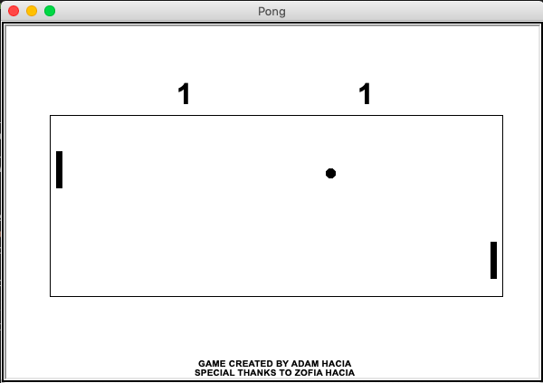
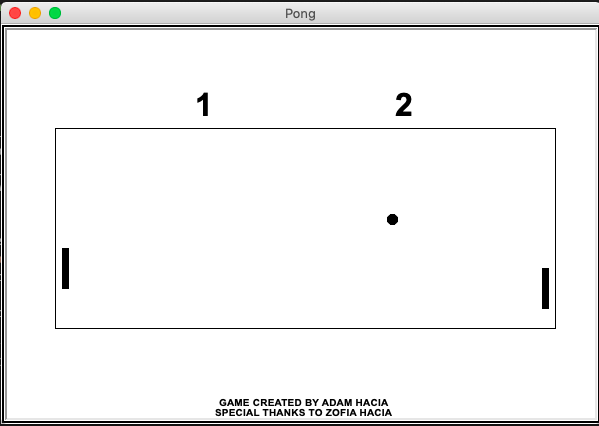
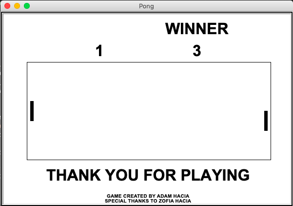

# PONG
> Simple Pong game written in ```Python``` using ```turtle``` library.

## Table of contents
- [PONG](#pong)
  - [Table of contents](#table-of-contents)
  - [Screenshots](#screenshots)
  - [Technologies](#technologies)
  - [Setup](#setup)
  - [Features](#features)
  - [Status](#status)
  - [Contact](#contact)

## Screenshots





## Technologies
* Python
* Turtle library for graphics

## Setup
1. Run ```game.py```
2. Player A move his pallet with ```W``` and ```S```
3. Player B move his pallet with ```right``` and ```down``` arrows

## Features
* Local multiplayer
* Sounds effects
## Status
Project is: _completed_

## Contact
Created by [@HondaPL](https://hacia.students.wmi.amu.edu.pl/) 

2019
